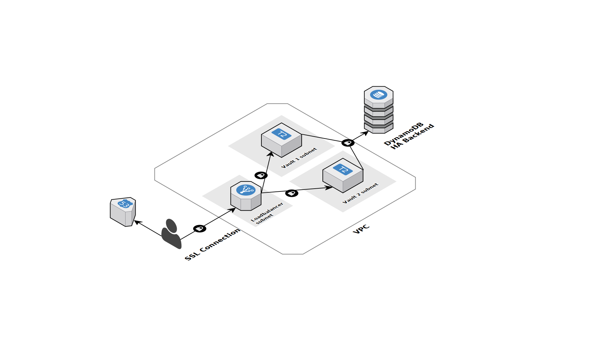

# terraform-instances
Terraform modules to set up a few commonly used instances. Based on the instance types it will automatically set the ebs_optimized parameter based on a list in the instance module.

## bastion

### Available variables:
* [`project`]: String(required): The current project
* [`environment`]: String(required): How do you want to call your environment, this is helpful if you have more than 1 VPC.
* [`subnets`]: List(required): The subnets where the bastion host must be placed in.
* [`ami`]: String(required): The id of the AMI created by Packer for the bastion host
* [`vpc_id`]: String(required): The VPC id to launch the instance in.
* [`sg_all_id`]: String(required): ID of the generic security group that will be extended to allow SSH access from the bastion host
* [`ssh_key_name`]: String(required): Name of the sshkey to deploy on the bastion instance
* [`name`]: String(optional):default bastion. Name of the instance
* [`instance_type`]: String(optional):default t2.micro. The instance type to launch for the bastion host.
* [`sgs`]: List(optional):default []. Additional security groups to add to the bastion host.
* [`policy`]: String(optional)default ec2:Describe*. Policy document to attach to the bastion host.
* [`termination_protection`]: Bool(optional)default false. If true, enables EC2 Instance Termination Protection.
* [`public_ip`]: Bool(optional)default false. Associate a public ip address with an instance in a VPC.
* [`root_vl_type`]: String(optional)default gp2. The type of volume. Can be "standard", "gp2", or "io1".
* [`root_vl_size`]: String(optional)default 30. The size of the volume in gigabytes.
* [`root_vl_delete`]: Bool(optional)default true. Whether the volume should be destroyed on instance termination
* [`user_data`]: List(optional)default [""]. The user data to provide when launching the instance. If `instance_count` >1, each instance launched will use user_data with the corresponding `user_data[count.index]`
* [`ebs_block_devices`]: List(optional)default []. A list of objects defining `ebs_block_device`, as described in the terraform documentation: https://www.terraform.io/docs/providers/aws/r/instance.html#block-devices
* [`ebs_enabled`]: Bool(optional)default True. Wether you want the instance to have an inline EBS definition.
* [`tags`]: Map(optional): Optional tags to add to the instance.

### Output
 * [`bastion_sg_id`]: String: The ID of the security group
 * [`instance_id`]: String: The instance IDs.
 * [`instance_az`]: String: The availability zone of the instances.
 * [`instance_key_name`]: String: The key name of the instances
 * [`instance_public_dns`]: String: The public DNS name assigned to the instance. For EC2-VPC, this is only available if you've enabled DNS hostnames for your VPC
 * [`instance_public_ip`]: String: The public IP address assigned to the bastion. NOTE: If you are using an aws_eip with your instance, you should refer to the EIP's address directly and not use public_ip, as this field will change after the EIP is attached.
 * [`instance_network_interface_id`]: String: The ID of the network interface that was created with the instance
 * [`instance_private_dns`]: String: The private DNS name assigned to the instance. Can only be used inside the Amazon EC2, and only available if you've enabled DNS hostnames for your VPC
 * [`instance_private_ip`]: String: The private IP address assigned to the instances
 * [`instance_vpc_security_group_id`]: String: The associated security groups in non-default VPC
 * [`instance_subnet_id`]: String: The VPC subnet ID.
 * [`iam_role_id`]: String: The IAM Role ID attached to the bastion host.

### Example
```
module "bastion" {
  source = "github.com/skyscrapers/terraform-instances//bastion"
  vpc_id        = "${module.vpc.vpc_id}"
  project       = "${var.project}"
  environment   = "${var.environment}"
  sg_all_id     = "sg-xxx"
  sgs           = ["sg-xxx","sg-xyz"]
  subnets       = ["subnet-xxx", "subnet-xyz"]
  ssh_key_name  = "mykey"
  ami           = "ami-123456"
  instance_type = "t2.micro"
}
```

## instance

### Available variables:
* [`project`]: String(required): The current project
* [`environment`]: String(required): How do you want to call your environment, this is helpful if you have more than 1 VPC.
* [`name`]: String(required): Name of the instance
* [`subnets`]: List(required): The subnets where the bastion host must be placed in.
* [`ami`]: String(required): The id of the AMI created by Packer for the bastion host
* [`key_name`]: String(required): Name of the sshkey to deploy on the bastion instance
* [`instance_type`]: String(required): The instance type to launch for the bastion host.
* [`sgs`]: List(required): Additional security groups to add to the bastion host.
* [`instance_count`]: Int(optional)default 1. Amount of bastion hosts to create.
* [`termination_protection`]: Bool(optional)default false. If true, enables EC2 Instance Termination Protection
* [`public_ip`]: Bool(optional)default false. Associate a public ip address with an instance in a VPC.
* [`root_vl_type`]: String(optional)default gp2. The type of volume. Can be "standard", "gp2", or "io1".
* [`root_vl_size`]: String(optional)default 30. The size of the volume in gigabytes.
* [`root_vl_delete`]: Bool(optional)default true. Whether the volume should be destroyed on instance termination
* [`user_data`]: List(optional)default [""]. The user data to provide when launching the instance. If `instance_count` >1, each instance launched will use user_data with the corresponding `user_data[count.index]`
* [`ebs_block_devices`]: List(optional)default []. A list of objects defining `ebs_block_device`, as described in the terraform documentation: https://www.terraform.io/docs/providers/aws/r/instance.html#block-devices
* [`ebs_enabled`]: Bool(optional)default True. Wether you want the instance to have an inline EBS definition.
* [`tags`]: Map(optional): Optional tags to add to the instance.

### Output
 * [`role_id`]: String: The ID of the role
 * [`instance_ids`]: List: The instance IDs.
 * [`instance_azs`]: List: The availability zone of the instances.
 * [`instance_key_names`]: List: The key name of the instances
 * [`instance_public_dns`]: List: The public DNS name assigned to the instance. For EC2-VPC, this is only available if you've enabled DNS hostnames for your VPC
 * [`instance_public_ips`]: List: The public IP address assigned to the instance, if applicable. NOTE: If you are using an aws_eip with your instance, you should refer to the EIP's address directly and not use public_ip, as this field will change after the EIP is attached.
 * [`instance_network_interface_ids`]: List: The ID of the network interface that was created with the instances
 * [`instance_private_dns`]: List: The private DNS name assigned to the instance. Can only be used inside the Amazon EC2, and only available if you've enabled DNS hostnames for your VPC
 * [`instance_private_ip`]: List: The private IP address assigned to the instances
 * [`instance_vpc_security_group_ids`]: List: The associated security groups in non-default VPC
 * [`instance_subnet_ids`]: List: The VPC subnet ID.

### Example
```
module "bastion" {
  source = "github.com/skyscrapers/terraform-instances//instance"
  project       = "${var.project}"
  environment   = "${var.environment}"
  name          = "web"
  sgs           = ["sg-xxx","sg-xyz"]
  subnets       = ["subnet-xxx", "subnet-xyz"]
  key_name      = "mykey"
  ami           = "ami-123456"
  instance_type = "t2.micro"
}
```

## puppet-userdata

This module generates a script that bootstraps puppet on the server. It'll install puppet 4 and target `puppetmaster01.int.skyscrape.rs` by default.

### Available variables:
* [`customer`]: String(required): Customer name
* [`project`]: String(optional): Name of the project
* [`environment`]: String(required): Environment it runs in
* [`function`]: String(required):Function of the server (eg web, db, elasticsearch)
* [`amount_of_instances`]: String(optional): For how many instances do you need user data. Defaults to 1
* [`puppetmaster`]: String(optional): Hostname of puppetmaster. Defaults to `puppetmaster01.int.skyscrape.rs`
* [`domain`]: String(optional): Domain to set as hostname. Defaults to `skyscrape.rs`

### Output
 * [`user_datas`]: List: The generated user-data script for each instance.

### Example
```
module "tools_userdata" {
  source              = "github.com/skyscrapers/terraform-instances//puppet-userdata?ref=1.0.1"
  amount_of_instances = "1"
  environment         = "${terraform.workspace}"
  customer            = "${var.customer}"
  function            = "tools"
}
```


## Vault

This terraform module sets up a HA vault with a DynamoDB backend.
The module sets up TLS using Letsencrypt with dns-01 challenge.

Both vault servers are optionally configured with Teleport for SSH management.

Two route53 records are provided to access the individual instances.



### Available variables

* [`acm_arn`]: String(required): The ACM ARN to use on the alb
* [`ami`]: String(required): The AMI ID to use for the vault instances
* [`dns_root`]: String(required): The root domain to configure for vault
* [`lb_subnets`]: List(required): The subnets to use for the alb
* [`key_name`]: String(required): Name of the sshkey to deploy on the vault instances
* [`teleport_auth_server`]: String(optional): The hostname or ip of the Teleport auth server. If empty, Teleport integration will be disabled (default).
* [`teleport_node_sg`]: String(optional): The security-group ID of the teleport server.
* [`teleport_token_1`]: String(optional): The Teleport token for the first instance. This can be a dynamic short-lived token.
* [`teleport_token_2`]: String(optional): The Teleport token for the second instance. This can be a dynamic short-lived token.
* [`vault1_subnet`]: String(required): The subnet ID for the first vault instance
* [`vault2_subnet`]: String(required): The subnet ID for the second vault instance
* [`vpc_id`]: String(required): The VPC id to launch the instances in.

* [`download_url_vault`]: String(optional): The download url for vault. Defaults to `https://releases.hashicorp.com/vault/0.9.0/vault_0.9.0_linux_amd64.zip`
* [`download_url_teleport`]: String(optional): The download url for Teleport. Defaults to `https://github.com/gravitational/teleport/releases/download/v2.3.5/teleport-v2.3.5-linux-amd64-bin.tar.gz`
* [`instance_type`]: String(optional): The instance type to use for the vault servers. Defaults to t2.micro
* [`lb_internal`]: Bool(optional): Should the ALB be created as an internal Loadbalancer
* [`project`]: String(required): Name of the project
* [`vault_nproc`]: String(optional): The amount of nproc to configure vault with. Set this to the amount of CPU cores. Defaults to 1

### Output

* [`sg_id`]: String: The vault security-group id
* [`vault_route53_record`]: String: The main vault route53 record id
* [`vault1_route53_record`]: String: The vault1 route53 record id
* [`vault2_route53_record`]: String: The vault2 route53 record id
* [`vault1_instance_id`]: String: The vault1 instance ID
* [`vault2_instance_id`]: String: The vault2 instance ID
* [`vault1_role_id`]: String: The vault1 instance-role ID
* [`vault2_role_id`]: String: The vault2 instance-role ID
* [`iam_policy`]: String: The iam policy ARN used for vault
* [`alb_main_target_group`]: String: The default alb target group ARN
* [`alb_vault1_target_group`]: String: The vault1 target group ARN
* [`alb_vault2_target_group`]: String: The vault2 target group ARN
* [`alb_sg_id`]: String: The alb security group ID
* [`alb_id`]: String: The alb id
* [`alb_arn`]: String: The alb ARN

### Example

```terraform
module "ha_vault" {
  source               = "github.com/skyscrapers/terraform-instances//vault?ref=2.0.0"
  teleport_auth_server = "10.10.0.100:3025"
  ami                  = "ami-add175d4"
  project              = "whatever"
  vault1_subnet        = "${data.terraform_remote_state.static.private_app_subnets[0]}"
  vault2_subnet        = "${data.terraform_remote_state.static.private_app_subnets[1]}"
  teleport_node_sg     = "${data.terraform_remote_state.static.teleport_node_sg_id}"
  vpc_id               = "${data.terraform_remote_state.static.vpc_id}"
  lb_subnets           = "${data.terraform_remote_state.static.public_lb_subnets}"
  acm_arn              = "${data.aws_acm_certificate.vault.arn}"
  teleport_token_1     = "c010f4fa754b7ad2a7a1d580e282d81b"
  teleport_token_2     = "6b69a780b9137g467f79ab7263337fd6"
  dns_root             = "${var.dns_root}"
  vault_nproc          = "2"
  key_name             = "sam"
}
```
